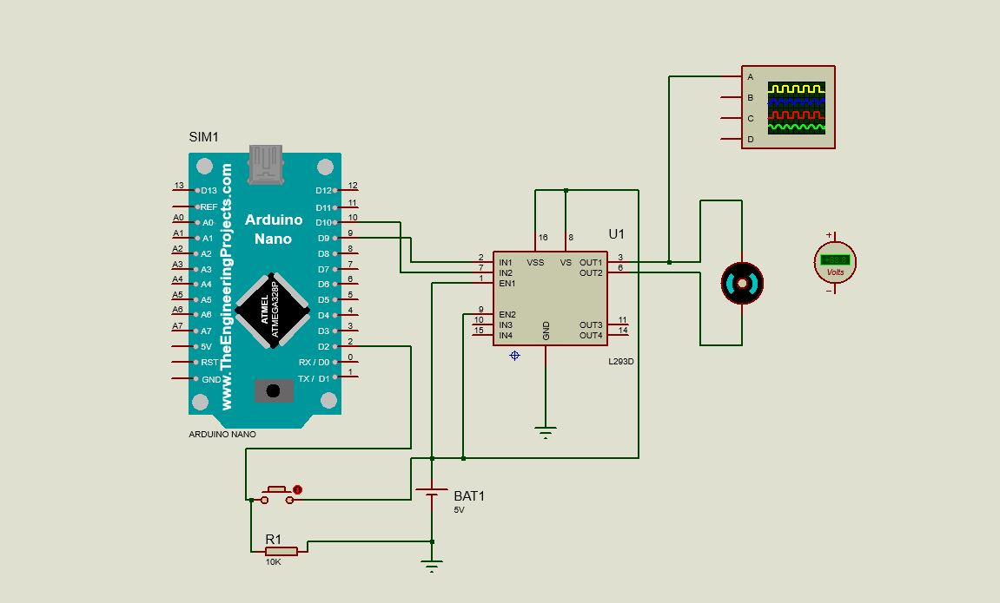

#introdução-ao-PWM:

PWM (Pulse-width modulation / modulação por largura de pulso) é uma técnica utilizada para permitir o controle da energia fornecida a equipamentos elétricos, como servomotores e dispositivos de iluminação.

##Funcionamento:

O PWM funciona modulando o ciclo ativo (duty cicle) de uma onda quadrada.  O controlador (fonte de tensão com PWM) entrega uma série de pulsos, gerados em intervalos de igual duração, que pode ser variada. Quanto mais largo o pulso, maior a quantidade de corrente fornecida à carga.

<h1>Componentes necessários.<h1>

Arduino Nano.

Resistor.

Motor.

Cell.

L293D.

Button.

2 Grounds.

Oscilloscope.

DC Voltometer.

#Esquemático 

Esquemático do circuito de modulação de largura de pulsos, feito no proteus.

<h1>Código Fonte.<h1>

#include <Arduino.h>

#define BUTTON_PIN 2
#define PWM 9

int estado_botao = 0;
int pwm = 0;
int ultimo_estado_botao = 0;
unsigned long tempo_acionado = 0;
unsigned long tempo_delay = 50;

void setup() {
  pinMode(PWM, OUTPUT);
  pinMode(BUTTON_PIN, INPUT_PULLUP);
}

void loop() {

  int leitura = digitalRead(BUTTON_PIN);

  if (leitura != ultimo_estado_botao) {
    ultimo_estado_botao = leitura;
    if (leitura == HIGH) {  
      tempo_acionado = millis();
    }
  }

  if (leitura == HIGH && ((millis() - tempo_acionado) > tempo_delay)) {
    pwm = pwm + 64;

    if(pwm > 255 ) {
        pwm = 0;
    }
  }

  #Funcionamento do prijeto:
  
Para este projeto foi utiilizado o programa Proteus 8 Professional, bastante utilizado para montar circuitos, onde temos a visão do Esquemático, do Pcb Layout e a Visão 3D.

